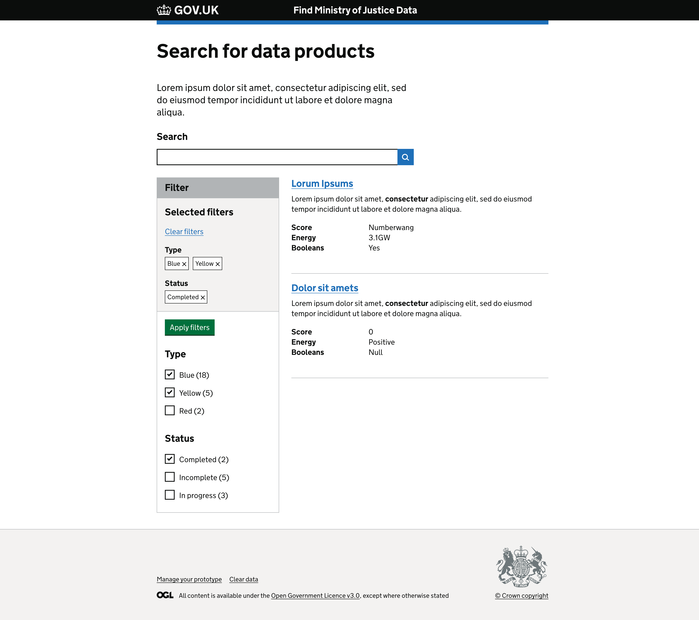

# Find MOJ data prototypes

A very hacky prototype of a data catalogue search page, to explore
which parts of the UI we can build up from GOV.UK components vs things we will have to customise.

Built with [GOV.UK prototype kit](https://prototype-kit.service.gov.uk/).

## How to run

See https://prototype-kit.service.gov.uk/docs/install/how-to-run-the-kit

## Missing behaviours

Currently the page is not fully interactable.

Ideally, interacting with filters on the left hand site should immediately refresh the search results if javascript is enabled.

We should integrate the MOJ filter pattern from https://design-patterns.service.justice.gov.uk/components/filter/
